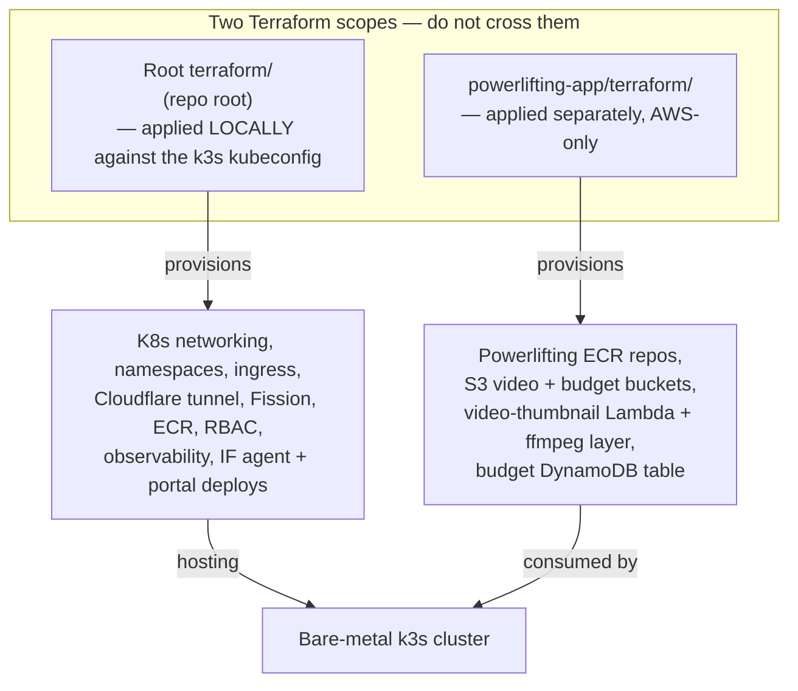

# AGENTS.md — Guidelines for agents and contributors working in this repo

This file tells an AI agent (or human contributor) how the powerlifting-app
stack is laid out, how the Terraform split works, and the rules to follow when
making changes here. Read it before writing code.

---

## The stack at a glance

The app runs on a **bare-metal k3s** cluster. The root `terraform/` at the repo
root is the infra stack — it is **applied locally** (it points `kubeconfig_path`
at the local k3s kubeconfig) and owns all the Kubernetes networking, namespace,
ingress, Cloudflare tunnel, Fission (OpenCode job pods), ECR, RBAC, and
observability resources, plus the IF agent and portal Deployments.

The `powerlifting-app/terraform/` in **this** directory is a **separate,
AWS-only** stack. It only creates powerlifting-specific resources:

- ECR repositories for the backend and frontend images
- S3 buckets for session videos and budget media
- the `video-thumbnail-generator` Lambda + its ffmpeg layer + S3 event trigger
- the `if-powerlifting-budget` DynamoDB table

The two stacks share an S3 Terraform backend (different state keys) and reference
shared table names via variables. **Do not move k8s/networking resources into
this directory's Terraform** — that belongs in the root stack. Conversely, do not
add powerlifting app resources to the root stack. Keep the scopes clean.

### Resource constraints drive the design

k3s on bare metal means resources are limited. That is why:

- the backend is a **thin transport layer** — heavy analytics and AI don't run in
  the Node process; they're delegated to the IF Agent API's health tools.
- **rolling Lambdas** are the intended path for expensive or bursty calculations
  so the cluster doesn't have to size for peak compute.
- when you add a compute-heavy feature, prefer a Lambda (see `lambda/` and
  `terraform/videos.tf` for the pattern) over a long-running pod.

### AWS and k3s creds are available for debugging

Runtime creds exist in the environment. When debugging runtime behavior:

- use `kubectl logs`, `kubectl describe`, `kubectl get events` against the k3s
  cluster — **do not guess at runtime behavior from code alone**.
- use the AWS CLI / SDK against DynamoDB, S3, and Lambda for data-path debugging.

Treat the resources as **production**. Be careful.

---

## Code rules

### Comments are a last resort

Do not add comments to the code unless it's an obscure edge case. Comments are a
failure of being able to convey intent through clean code. Before reaching for a
comment, ask whether a better name, a smaller function, or a clearer structure
would make the comment unnecessary. If you must comment, explain _why_, not
_what_.

### Use libraries and providers — rarely hand-roll

Prefer established libraries and cloud-managed resources over hand-rolled
equivalents. Reach for a provider/managed service first; only hand-roll when
there is a concrete reason the library can't do the job. This applies to both
application code (use the SDKs and packages already in `package.json`) and
infrastructure (use Terraform providers rather than scripting around them).

### Responsive design down to iPhone SE

Every screen must work on small viewports. The minimum supported viewport is the
**iPhone SE (375px wide)**. Test new layouts and components at that width. If a
layout breaks below a larger breakpoint, fix it — don't add a disclaimer.

### Logging

Add a log entry at **every function call and interactive component**, and at every
**failure node**. These logs are the debugging surface when something goes wrong
in the cluster. Use the existing `backend/src/utils/logger.ts` (pino) on the
backend; follow the established frontend logging conventions. A function that
fails silently is a bug factory.

### Errors must be loud

No migration fallbacks. No clever error handling that swallows a failure and
limps on. Errors are meant to be loud so we can catch them. Let exceptions
propagate; surface failures to the user and to the logs. If a code path can
fail, it should fail visibly, not return a silent default.

### Do not permute DynamoDB objects with the `pk` = `operator`

The `operator` partition key is the **admin user's data**. Never write, mutate,
or permute Dynamo objects under `pk = operator`. When you need test data, use
the `test` partition (`pk = test`) and the `if-portals-test` namespace. The
`mapped_pk` resolution (`mapped_pk || pk`) redirects authenticated users away from
`operator` — do not bypass it.

### Stay on task; note bugs separately

When you encounter code that could have a possible bug, **note it in `bug.md`**
at the repo root, then continue with the main task. Do not rabbit-hole into
fixing it unless the bug is the task. One line per bug in `bug.md` is enough:
file path, short description. The focus stays on the requested change.

### Debugging Approach

- **When stuck on a bug, stop speculating and gather real information first**
- If a root cause isn't obvious from reading the code, add logging/instrumentation and ask the user to run it — don't keep re-theorising without data
- Avoid the "wait, actually the real issue is..." loop: form one clear hypothesis, test it, then reassess based on evidence

### Every feature is multi-interface

Any feature — calculations, analytics, AI skills — must be reachable through
**Discord** as well as the web UI. The UI is just one possible interface for the
user to work with their training data. Because the backend delegates to the IF
Agent API's health tools (the same tools the Discord agent exposes), features
are multi-interface by default — do not add a feature that only the web UI can
do. If a feature isn't callable through the agent tools, it's incomplete.
