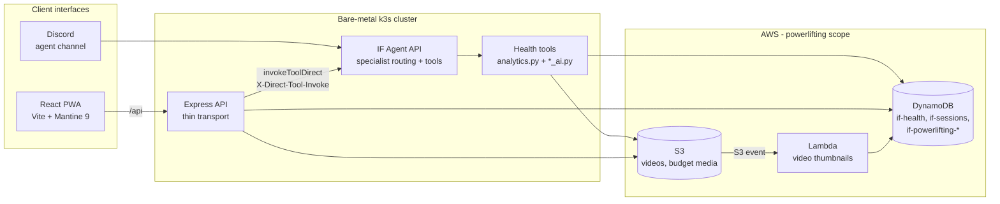
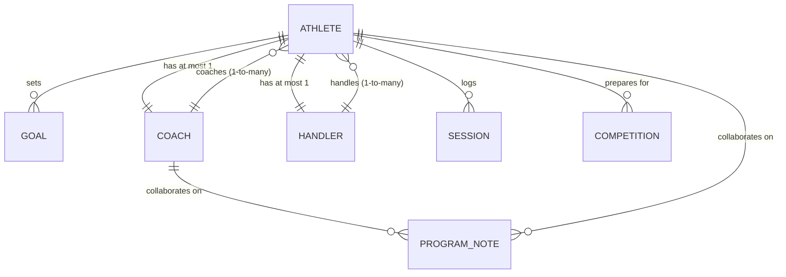

# NoLift A powerlifting meet-prep portal

Powerlifting is just a hobby for me. I got frustrated with my lack of progress,
so I decided to pull together all my historical training data and actually look
at what works.

Over six years of lifting I've had mixed experiences with coaches some really
great, some providing cookie-cutter coaching. I came to the conclusion that my
bad experiences came down to a lack of communication. But it's hard to explain
six years of training history to someone over a couple of sessions. This
platform exists to fix that: it aggregates everything past workouts, fatigue
profile, budget, even past competition performance and lift videos into one
place an athlete can share with their coach so they can collaborate on training.

This is a **competition-geared** notebook, not a free-form workout tracker. The
assumption is that the athlete is preparing for a meet, because meets provide the
guidelines and standards an athlete must adhere to a much better anchor for a
training app than open-ended logging.

> This is not meant to replace coaching. It's a notebook where coaches and
> athletes can use formulas and AI to collaborate on their meet-prep journey.

---

## Why I'm building it

I'm testing the app by being its first user. I use it for my own training and
comp prep and adjust it based on perceived needs or bugs I run into.

### My numbers

My last completed meet (data pulled straight from the app's DynamoDB store):

|                                               | Squat  | Bench  | Deadlift | **Total**  | Bodyweight |
| --------------------------------------------- | ------ | ------ | -------- | ---------- | ---------- |
| **Ottawa Open & Bench Press** CPU, 2025-10-04 | 185 kg | 115 kg | 220 kg   | **520 kg** | 78.2 kg    |

The projection at T‑1 week had me at 546.4 kg (total Projection-to-Result Ratio
of 0.952). My own notes from that day: _"sandbagged deadlifts: had at least
10 kg in me."_ That gap between projected and actual is exactly what the
projection-calibration math is designed to close over future meets.

My goal for 2026 is a **550 kg total** and to explore different federations. I
haven't locked down which meet I'm running yet, so the current program targets
aren't shown here they shift as I decide.

### A learning tool, too

I'm also using this project as a learning tool to play with AI prompting
techniques, tools, and AI-specific architecture, and to keep my software-design
skills fresh. Expect the AI side to evolve fast.

---

## Features

The portal is split into athlete-facing features today, with social features on
the roadmap.

### Training

- **Dashboard** the main hub summarizing the current program state.
- **Sessions** calendar (Month / Agenda / Compact views), full session editor
  with planned vs logged work, per-set statuses, failure reasons, RPE, wellness,
  pain log, and video attachments.
- **Analysis** the analytics hub with four tabs:
  - **Weekly** current maxes, compliance, fatigue, readiness, peaking,
    workload, alerts, and AI correlation + program evaluation.
  - **Blocks** per-block deterministic analytics, AI evaluation, and exports.
  - **Compare** cross-block and lifetime comparison (deterministic + AI).
  - **Maxes** all-time and windowed max history.
- **Designer** phase CRUD, drag-and-drop session design, goals, federations,
  competitions, glossary.
- **Templates** library, creation, block-to-template conversion, AI
  evaluation, import jobs.
- **Import wizard** AI-assisted spreadsheet import (classification → parse →
  glossary resolution → apply).
- **Glossary** canonical exercise definitions, muscle mapping, generated
  exercise text, fatigue profiles, accessory e1RM estimates.
- **Lift profiles** per-lift (squat/bench/deadlift) style notes, sticking
  points, stimulus coefficient, INOL thresholds, e1RM multiplier.
- **Tools** DOTS calculator, attempt selector, unit converter, percent table,
  plate calculator, weight tracker.
- **Videos** S3-backed lift video library with auto-generated thumbnails.
- **Rankings** compare your totals/DOTS against the OpenPowerlifting dataset.
- **Profiles** public lifter profile search and your own profile management.
- **Budget** comp-prep budget tracking (equipment, supplements, memberships,
  meet entry) with a purchase timeline.
- **Supplements / Biometrics / Notes** supplement phases, diet & recovery
  notes, dated program notes.

### The UI is just one interface

Every feature calculations, analytics, AI skills is also reachable through
**Discord**. The web portal is one possible interface; you can interact with the
same training data by talking to the agent in Discord. The backend is a thin
transport layer that calls the same health tools the agent exposes, so nothing is
locked behind the UI.

---

## Calculations

The deterministic analytics are the backbone. None of it is textbook-generic
every formula was customized for meet prep on real (noisy) training logs.

Highlights (full math and reasoning in [`docs/FORMULAS.md`](docs/FORMULAS.md)):

- **Conservative e1RM** RPE-table / conservative-percent estimate, 90th
  percentile of executed sets over 6 weeks. No Epley/Brzycki.
- **Progression rate** Theil-Sen regression on best weekly e1RM, deload-aware
  effective-week indexing.
- **Meet projection** diminishing-returns curve, DOTS-gated decay & peak
  factors, taper- and deload-aware, clamped ceiling.
- **Projection calibration (PRR)** post-meet re-tuning of the decay factor
  from actual-vs-projected ratios.
- **4-dimensional fatigue** axial / neural / peripheral / systemic, nonlinear
  per-set load scaling.
- **Fatigue index** failures, acute spikes, RPE, intensity density, monotony,
  and decaying reservoirs; skip-rate isn't allowed to dilute real fatigue.
- **Stimulus-adjusted INOL** INOL modulated by per-lift stimulus coefficient.
- **Phase-aware RPE drift & readiness** residual against phase target midpoint,
  missing-data-aware re-weighted readiness score.
- **Volume landmarks** MV / MEV / MAV / MRV from whole-program history.
- **Specificity ratio** narrow & broad SBD specificity with weeks-to-comp
  bands.
- **Banister CTL/ATL/TSB**, taper quality, **DOTS** and **IPF GL** scoring.

## AI components

The AI is narrow and tool-scoped it never calls the model directly from the
browser. Every AI request goes through the IF Agent API as a specialist tool
invoke. There are 10+ AI surfaces (details in [`docs/ARCHITECTURE.md`](docs/ARCHITECTURE.md)):

- Exercise **ROI correlation** analysis
- **Program evaluation** (full-block, structured stance/strengths/strategy)
- **Multi-block lifetime comparison**
- **Lift-profile** review / rewrite / stimulus-coefficient estimation
- **Accessory e1RM backfill**
- **Template evaluation**
- **Spreadsheet import** (classify / parse / glossary-resolve)
- **Glossary text generation** and muscle-group estimation
- **Fatigue-profile estimation**
- **Session note drafting** and **auto-regulation** suggestions

---

## Architecture



The stack runs on a **bare-metal k3s** cluster for cost savings, but it's
designed so I can spin up more nodes in AWS or any other cloud. I'd just need to
create an NFS server that provides secure access to my local master node, then
cloud-native workloads could connect to that and work seamlessly. I also plan to
lean on **Lambdas for calculations** for that flexibility.

For more on the request flow, data model, caching, and AI execution model, see
[`docs/ARCHITECTURE.md`](docs/ARCHITECTURE.md).

### Target release form

A **PWA** for quick validation and testing installable, offline-capable, and
fast to iterate on.

---

## Roadmap

Right now the focus is **athlete-specific features**. Planned social features:



- **Profiles** for athletes, handlers, and coaches.
- **Coach / athlete relationships** one-to-many: a coach can have multiple
  athletes; to avoid complexity, an athlete can only have **one coach** and
  **one handler**.
- **Handler matching** same one-to-many rule for handlers.
- **Forums** for like-minded lifters.
- More **cloud portability** (NFS-backed cross-cloud workloads) and
  **lambda-powered calculations**.

This isn't meant to replace coaching it's a shared notebook where coaches and
athletes use the formulas and AI above to collaborate on the meet-prep journey.

---

## Repository map

```
powerlifting-app/
├── backend/        Express API (thin transport → IF Agent API)
├── frontend/       React 19 + Vite PWA
├── packages/types/  Shared TypeScript types
├── lambda/         Lambdas: master-sync, video-thumbnail (ffmpeg)
├── docker/         Container build context
├── terraform/      Powerlifting-specific AWS resources (ECR, S3, Lambda, budget table)
└── docs/           Architecture, formulas, and the implementation reference
```

See [`PROJECT_STRUCTURE.md`](PROJECT_STRUCTURE.md) for the annotated tree and
[`AGENTS.md`](AGENTS.md) for the guidelines agents and contributors must follow
when working in this repo.
