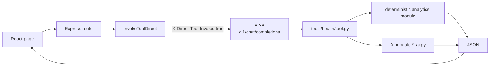
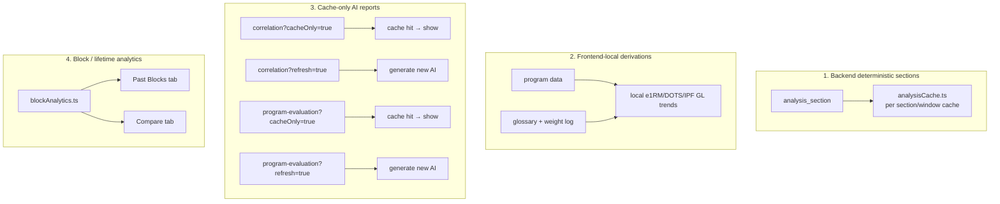
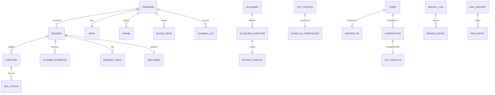
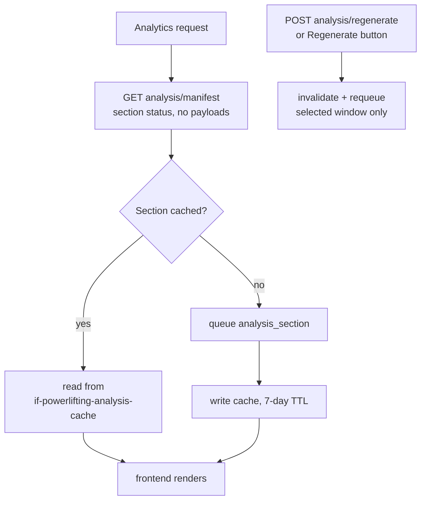
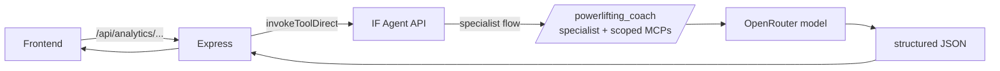

# Architecture

Software and technical deep-dive for the powerlifting portal. For the math, see
[`FORMULAS.md`](./FORMULAS.md). 

## High-level request flow

The backend is intentionally a **thin transport layer**. Most serious analytics
and AI work does not run in the Node process — it is delegated to the IF Agent
API's health tools.



The same health tools are exposed to the **Discord agent**, which is why every
web feature is also reachable through Discord — the UI is one of two interfaces
into the same tools.

## Analysis page: the four computation paths

`AnalysisPage.tsx` is the analytics hub. It has four top-level section tabs
(Weekly, Blocks, Compare, Maxes) toggled via `?type=`. The Weekly tab alone has
four distinct computation paths:



1. **Backend deterministic sections** — `analysis_section`, queued and cached per
   section/window by `analysisCache.ts`. Current section keys: `overview`,
   `fatigue_readiness`, `peaking`, `workload`, `alerts`.
2. **Frontend-local derivations** — computed in-browser from program data,
   glossary, and the weight log (e.g. local e1RM/DOTS/IPF GL trend cards).
3. **Cache-only-by-default AI reports** — correlation analysis and full-block
   program evaluation load from cache; explicit Generate/Refresh buttons
   (`refresh=true`, `cacheOnly=false`) produce new AI output.
4. **Block / lifetime analytics** — `blockAnalytics.ts` powers the Past Blocks and
   Lifetime Compare tabs.

Important consequence: the top max card (frontend-derived) can legitimately
*differ* from the backend `current_maxes` used by projections and INOL. This is
documented, not a bug.

## Data model



### Storage

| Store | Backend | Purpose |
|-------|---------|---------|
| `if-health` | DynamoDB | Program document, glossary, max history, weight log, analysis cache refs, AI report caches (ROI/program-eval) |
| `if-sessions` | DynamoDB | Sessions (separate from program; merged by version in `programController.getProgram()`) |
| `if-user` | DynamoDB | Identity/profile mapping, `mapped_pk`, Discord identity, profile visibility |
| `if-powerlifting-analysis-cache` | DynamoDB | Pre-computed window/section/job/block/markdown analytics (7-day TTL) |
| `if-powerlifting-user-competitions` | DynamoDB | User-scoped competition records |
| `if-powerlifting-master-competitions` | DynamoDB | Master competition directory |
| `if-powerlifting-master-federations` | DynamoDB | Federation library + qualification standards |
| `if-powerlifting-goals` | DynamoDB | Athlete goals |
| `if-powerlifting-budget` | DynamoDB | Budget items + config |
| `powerlifting-session-videos` | S3 | Lift videos (+ thumbnails, + processed) |
| `powerlifting-budget-media` | S3 | Budget item photos |
| `video-thumbnail-generator` | Lambda | S3-triggered ffmpeg thumbnail generation |

### `mapped_pk` flow

```mermaid
flowchart LR
  Req[Incoming request] --> Auth{Authenticated?}
  Auth -- no --> Op[mapped_pk = "operator"\nreadOnly = true\nread-only]
  Auth -- yes --> Load[load/create if-user record]
  Load --> Resolve[resolve mapped_pk || pk]
  Resolve --> Store[req.mapped_pk]
  Store --> Use[used as pk for\nif-health, if-sessions,\nanalysis cache writes]
```

Anonymous requests resolve to `operator` and are read-only. Authenticated users
load/create an `if-user` record and use `mapped_pk || pk`. `mapped_pk` exists
only when the user's training data should be redirected to a different partition.

### Storage conventions

- Dates are `YYYY-MM-DD`; timestamps are ISO8601.
- Weights are stored in **kilograms**; frontend unit switching is display-only.
- Powerlifting weeks are program/block-defined, not calendar weeks — analysis
  uses stored `block_week_start_days[block]` plus the caller's `asOfDate`.

### Program meta

`Program.meta` carries identity/versioning, timeline, training-week boundaries,
federation/class context, bodyweight, targets, attempt defaults, anthropometrics,
manual maxes, per-block start maxes, program history, template lineage, and
`sex` for DOTS/IPF GL.

### Sessions and sets

`Session` holds date/day/week/phase/block, status, planned vs logged exercises,
subjective context (notes, RPE, bodyweight, wellness, pain log), and videos.

`set_statuses[]` is the per-set execution state: `pending | completed | failed |
skipped`. `completed` and `failed` count as executed sets; `skipped` and
`pending` do not contribute to volume, fatigue, INOL, specificity, or muscle-set
totals. `failed_set_reasons[][]` align to `set_statuses[]` (strength/technical/
command/grip/depth/pause/lockout/balance/pain/fatigue/misload tags).

### Lift profiles

Per lift (squat/bench/deadlift): style notes, sticking points, primary muscle,
volume tolerance, `e1rm_multiplier`, `stimulus_coefficient` (with confidence +
reasoning), and INOL low/high thresholds. Used two ways:

1. **Deterministically** — `stimulus_coefficient` modifies INOL.
2. **As AI context** — for lift-profile review/rewrite, stimulus estimation,
   fatigue-profile estimation, correlation, program evaluation, accessory e1RM
   backfill, template evaluation, and import.

## Caching strategy



- Section API keys are window-scoped (`current`, `previous_1/2/4/8`, `block`).
- The legacy `weekly-bundle` endpoint still exists for compatibility/export
  tooling; the Weekly tab reads sections instead.
- AI correlation and program-evaluation reports cache separately and only
  regenerate on explicit refresh (never via the main regenerate endpoint).
- Program-evaluation cache keys include a `block_notes_fingerprint`; session
  changes do **not** invalidate it (block-note changes do, via the fingerprint).
- Past-block exports render only already-cached material — they do not pull
  full session history.

## AI execution model

The portal **never** calls OpenRouter from the browser or backend feature
routes. AI requests go through the IF Agent API. Specialist flows use IF
slash-specialist commands (e.g. `/powerlifting_coach`), so model selection,
specialist prompts, tool access, and context injection stay inside the IF
agent layer.


### Current model variables

| Variable | Used by |
|----------|---------|
| `ANALYSIS_MODEL` (+ `..._THINKING_BUDGET`) | correlation, program evaluation, template evaluation, import parsing |
| `ESTIMATE_MODEL` (+ `..._REASONING_EFFORT`, `..._VERBOSITY`) | fatigue estimation, muscle-group estimation, lift-profile estimate flows, accessory e1RM backfill |
| `HEALTH_HELPER_MODEL` | session note drafting, auto-regulation, lift-profile rewrite cleanup |
| `MODEL_ROUTER_MODEL` | lightweight routing |
| `IMPORT_FAST_MODEL` | import classification + glossary resolution |
| `GLOSSARY_TEXT_MODEL` | glossary text generation |

## Authentication

Discord OAuth2. `LoginPage` starts the flow; `AuthCallbackPage` verifies the
session via `GET /api/auth/me` (httpOnly cookie). `GET /api/auth/me` returns
`user`, `mapped_pk`, and `readOnly`.

Profile/settings routes: `GET /api/settings`, `PUT /api/settings/nickname`
(`[a-z0-9_-]{2,32}`), `PUT /api/settings/profile`, `POST /api/settings/avatar`,
`GET /api/profiles/search?q=`, `GET /api/profiles/:nickname`.

## Video pipeline

```mermaid
flowchart LR
  Up[Frontend upload\nPOST /api/videos/:version/:date] --> PutS3[PUT S3 videos/key.ext]
  PutS3 --> Patch[patch Session.videos[]\nthumbnail_status=pending]
  PutS3 -->|S3 ObjectCreated| Lam[video-thumbnail Lambda]
  Lam -->|ffmpeg| Thumb[generate thumbnail]
  Lam -->|PATCH /api/videos/.../thumbnail| Patch2[thumbnail_status=ready|failed]
  Play[Browser] -->|GET /api/videos/media/{path}| Proxy[S3 media proxy + Range support]
```

- Accepted MIME: `video/mp4`, `video/quicktime`, `video/webm`, `video/x-msvideo`.
- Backend upload limit 500 MB. S3 key: `videos/<sessionDate>/<videoId>.<ext>`.
- No computer-vision analysis is performed today.

## Current rough edges

Deliberate or temporary mismatches to be aware of (not all are bugs to fix):

1. The top max card prefers local RPE-table/conservative-percent trend maxima and
   falls back to backend `current_maxes` — they can differ.
2. `attempt_selection` is computed but not rendered on the Analysis page.
3. Program-evaluation gating differs between frontend (≥4 completed sessions)
   and backend (≥4 completed weeks).
4. Template evaluation still passes mocked, minimal athlete context
   (`dots_score=350`, `weeks_to_comp=12`).
5. `TimelinePage.tsx` and `DietNotesPage.tsx` have no registered route.

When you encounter a possible bug, note it in `bug.md` and stay on task — see
[`AGENTS.md`](../AGENTS.md).
